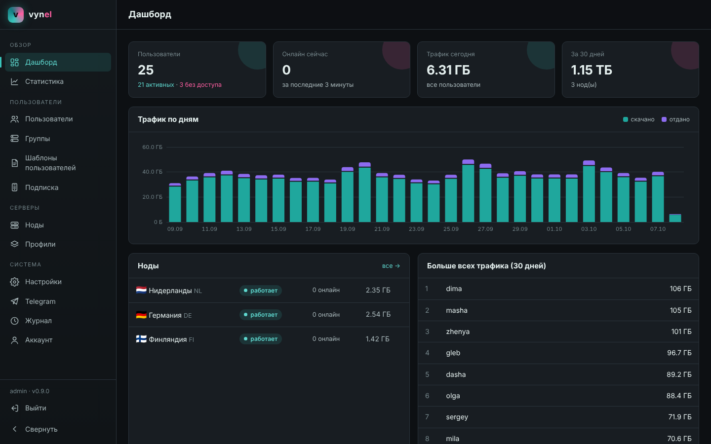
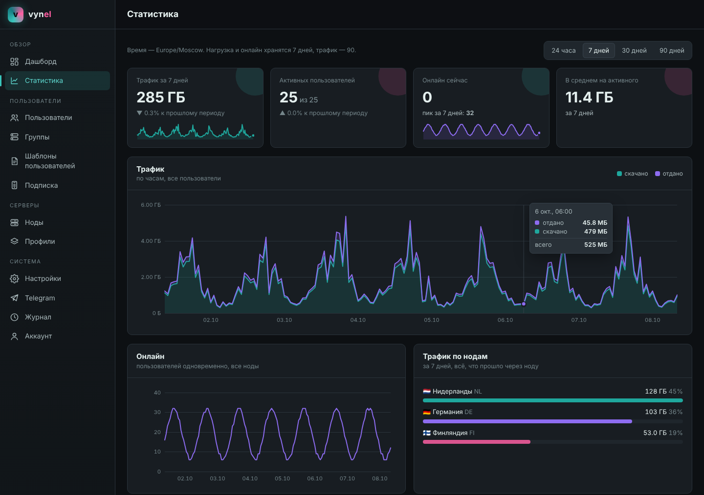
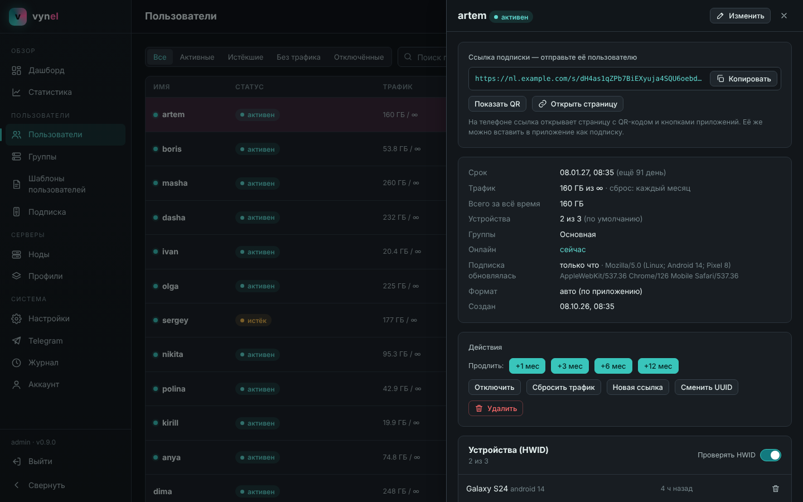
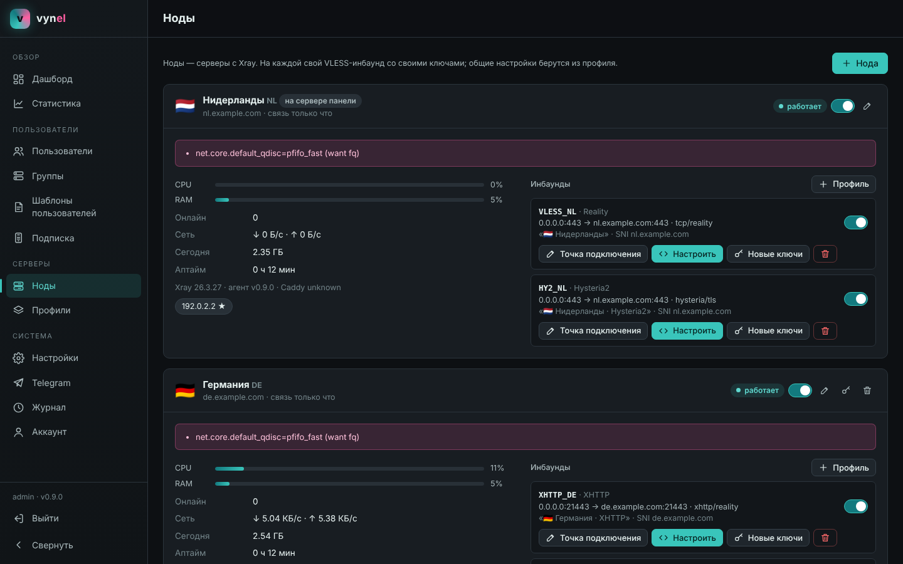
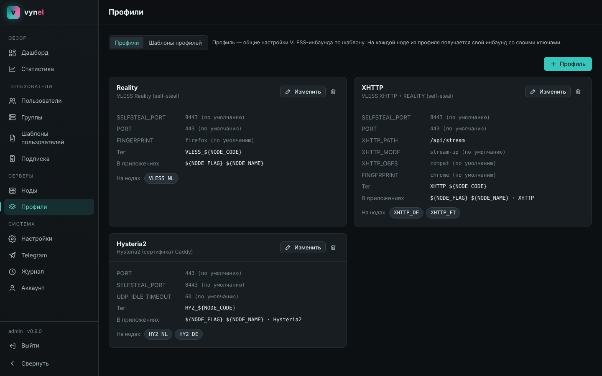
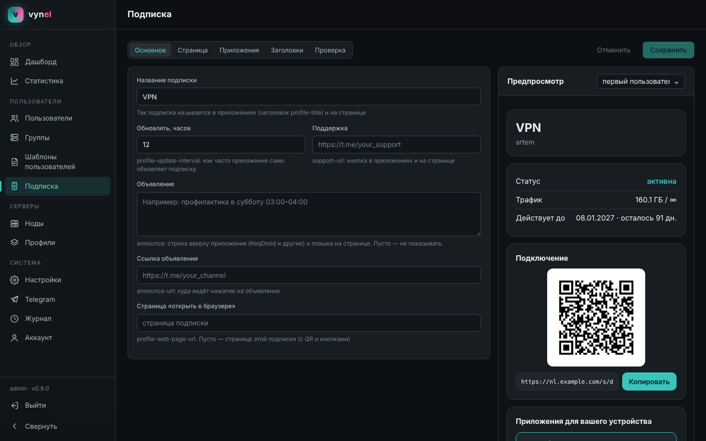
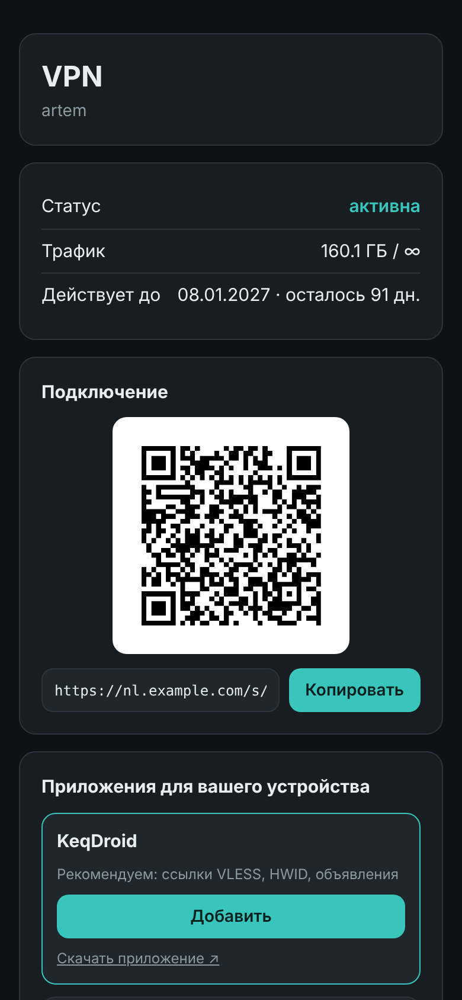
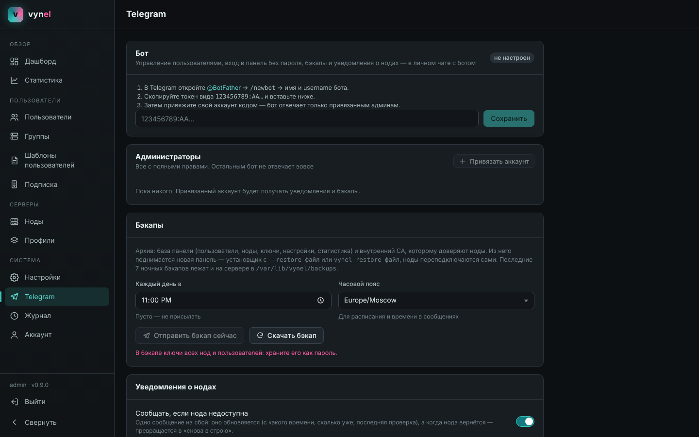
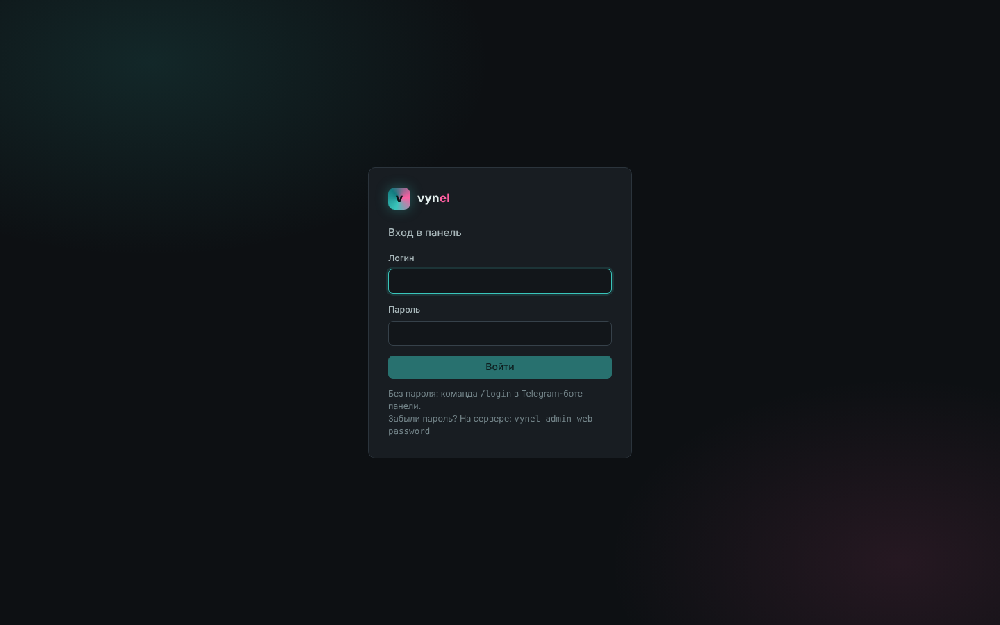

<div align="center">


# vynel

**Свой VPN за 5 минут: панель, ноды и подписки на Xray — одной командой.**

VLESS Reality · XHTTP · Hysteria2 · один бинарь · один домен · без Docker

[](https://github.com/vyto4ka/vynel/actions/workflows/ci.yml)
[](https://github.com/vyto4ka/vynel/releases)
[](go.mod)
[](https://github.com/XTLS/Xray-core)
[](https://caddyserver.com)
[](#-требования)
[](#-telegram-бот-и-бэкапы)

**[⚡ Установка](#-установка)** · [Почему vynel](#-почему-vynel) · [Скриншоты](#-скриншоты) · [Возможности](#-возможности) · [Документация](#-документация)

</div>

---

## ⚡ Установка

Нужен VPS на Ubuntu или Debian, root и **один домен** с A-записью на IP сервера. Запустите:

```bash
bash <(curl -fsSL https://raw.githubusercontent.com/vyto4ka/vynel/main/scripts/install.sh)
```

Откроется меню: **всё на одном сервере** (проще всего начать с него), только панель, только нода, обновить, удалить. Установщик задаст пару вопросов, сам получит сертификат, поднимет VPN и покажет **адрес панели, логин и пароль**.

Дальше в панели: «Пользователи» → «+ Пользователь» → скопировать ссылку → открыть на телефоне → **KeqDroid** добавит подписку одной кнопкой.

> Пошагово, с отдельной панелью, нодами и решением проблем — **[INSTALL_GUIDE.md](docs/INSTALL_GUIDE.md)**.

---

## 💎 Почему vynel

| | |
|---|---|
| 🚀 **Одна команда — и всё работает** | Панель, VPN, сертификат, сайт-заглушка и подписки встают на **одном сервере с одним IP и одним доменом**. Без Docker, без nginx и certbot руками, без ручных JSON-конфигов. |
| 🧩 **Конфиг собирается сам** | Профиль выбирается из шаблона, а ключи Reality, shortId, SNI, пути и точки подключения генерируются **для каждой ноды автоматически**. Настройки подключения в подписке не нужно дублировать вручную — они берутся из того же конфига и не расходятся. |
| 🛡 **Сервер не отличить от сайта** | Reality ведёт «чужих» на ваш собственный сайт с настоящим сертификатом. Панель живёт на секретном пути, подписки неотличимы от обычных страниц, перебор токенов банится. |
| ⚡ **Три протокола на одном порту** | VLESS Reality и XHTTP на TCP 443, **Hysteria2 на UDP 443** — на том же домене и том же сертификате, который продлевается сам. |
| 🔁 **Изменения — без перезапусков** | Пользователи добавляются, продлеваются и отключаются на нодах **за секунды через API Xray**, без разрыва соединений у остальных. |
| 🪶 **Лёгкая** | Один Go-бинарь (~40 МБ) и SQLite. Спокойно работает на 1 vCPU / 1 ГБ. Нода — тот же бинарь с агентом. |
| 🔐 **Надёжная связь панели и нод** | gRPC поверх взаимного TLS со своим CA. Если связь пропала, статистика копится на ноде и доходит потом **без потерь**. |
| 🤖 **Telegram-бот из коробки** | Пользователи из чата, вход в панель **без пароля** одной кнопкой, бэкап каждую ночь и восстановление панели одной командой, уведомления о недоступных нодах **без спама**. |
| 🧯 **Безопасные обновления** | Обновление ничего не качает зря, не висит на медленном GitHub и **откатывается само**, если новая версия не стартовала. |
| 🩺 **Понятно, что сломалось** | `vynel node diag` собирает отчёт о ноде (версии, сертификаты, порты, проверка сайта-заглушки) без ключей и UUID — его можно сразу отправить. |

---

## 📸 Скриншоты

<table>
<tr>
<td width="50%"><br><sub><b>Дашборд</b> — пользователи, онлайн, трафик, ноды</sub></td>
<td width="50%"><br><sub><b>Статистика</b> — трафик, онлайн, нагрузка нод, активность по часам</sub></td>
</tr>
<tr>
<td><br><sub><b>Пользователи</b> — продление в один клик, устройства, ссылка с QR</sub></td>
<td><br><sub><b>Ноды</b> — состояние, нагрузка, инбаунды, новые ключи одной кнопкой</sub></td>
</tr>
<tr>
<td><br><sub><b>Профили</b> — Reality, XHTTP, Hysteria2 из готовых шаблонов</sub></td>
<td><br><sub><b>Подписка</b> — вид страницы, кнопки приложений, заголовки, предпросмотр</sub></td>
</tr>
</table>

<details>
<summary><b>Ещё: страница подписки на телефоне, Telegram, вход</b></summary>
<br>
<table>
<tr>
<td width="28%"><br><sub>Страница подписки на телефоне</sub></td>
<td width="72%"><br><sub>Telegram-бот, бэкапы, уведомления о нодах</sub><br><br><br><sub>Вход в панель</sub></td>
</tr>
</table>
</details>

---

## ✨ Возможности

### 🌐 Протоколы и маскировка

- **VLESS + Reality (self-steal)** — основной профиль: сервер выглядит как ваш сайт с настоящим сертификатом.
- **VLESS + XHTTP + REALITY** — трафик похож на обычные HTTP-запросы к сайту; режимы `stream-up` и `packet-up`, совместимая разметка для любых клиентов на ядре Xray.
- **VLESS + XHTTP через CDN** — запасной вход, когда IP серверов недоступны.
- **Hysteria2** — QUIC на UDP 443 рядом с Reality, на том же сертификате; хорош на мобильных сетях и каналах с потерями.
- TLS-отпечаток (fingerprint) выбирается в профиле. Свои шаблоны пишутся прямо в панели — с подсветкой, проверкой и предпросмотром.

### 👥 Пользователи и подписки

- Срок, лимит трафика с автосбросом (день / неделя / месяц), лимит устройств по **HWID** — общий или свой у каждого, можно выключить конкретному пользователю.
- **Одна ссылка** на пользователя: приложение само получает подходящий формат — ссылки, Clash/Mihomo, sing-box или Xray JSON.
- В браузере ссылка открывает **красивую страницу** с QR-кодом, трафиком, сроком и кнопкой «добавить в приложение». Вид страницы, тексты, объявление и заголовки для приложений настраиваются в панели.
- Группы: кому какие серверы, профили или отдельные инбаунды. Шаблоны пользователей для быстрого создания.

### 🖥 Ноды

- Новый сервер — **одна команда**, которую выдаёт панель («Ноды» → «+ Нода»).
- Несколько IP на сервере, вход и выход через разные адреса, автоматическая раскладка портов между Xray и Caddy.
- BBR, fq и TCP Fast Open настраиваются сами; сайты-заглушки встроены.

### 📊 Статистика

- Трафик за 24 часа / 7 / 30 / 90 дней со сравнением с прошлым периодом, онлайн, трафик и нагрузка по нодам, тепловая карта «когда пользуются», топ пользователей, приложения и платформы устройств.

### 🤖 Telegram-бот и бэкапы

- Создание, продление, отключение пользователей прямо из чата; карточка со ссылкой для отправки.
- **Вход в панель без пароля**: одноразовая ссылка на минуту.
- **Бэкап каждую ночь** в Telegram; новая панель поднимается из него одной командой, ноды переподключаются сами.
- Уведомления о недоступной ноде — **одно сообщение, которое обновляется**, а не спам.

---

## 🧭 Как это устроено

```
                    ┌────────────────────────── сервер ──────────────────────────┐
 KeqDroid ─────────►│ TCP :443  Xray: VLESS Reality / XHTTP                       │
                    │            ├─ VPN-клиент ─────────────────────────────► интернет
 браузер ──────────►│            └─ всё остальное ─► Caddy 127.0.0.1:8443        │
                    │                                 ├─ /s/<токен>  → подписка   │
                    │                                 ├─ /<секрет>/  → веб-панель │
                    │                                 └─ остальное   → сайт       │
 KeqDroid ─────────►│ UDP :443  Xray: Hysteria2 (тот же сертификат)               │
                    │ TCP :80   Caddy: сертификат Let's Encrypt                   │
                    │ vynel: панель, подписки, статистика, бот, агент ноды        │
                    └─────────────────────────────────────────────────────────────┘
                             ▲ gRPC + mTLS (:9443)
                             └──── другие ноды: vynel node + Xray + Caddy
```

---

## 📋 Требования

| | |
|---|---|
| Система | Ubuntu 20.04+ или Debian 11+, `amd64` или `arm64` |
| Ресурсы | от 1 vCPU и 1 ГБ RAM |
| Сеть | публичный IP, свободные TCP 80 и 443 (для Hysteria2 — ещё UDP 443) |
| Домен | один домен с A-записью на сервер (для подписок и панели можно отдельные) |
| Клиент | **[KeqDroid](https://github.com/Lemonochka/keqdroid/releases/latest)** — Android, Windows, Linux |

---

## 🛠 Управление из терминала

```bash
vynel admin user add vasya                 # новый пользователь (срок и лимиты из шаблона)
vynel admin user show vasya                # ссылка подписки, трафик по нодам
vynel admin user extend vasya --months 1   # продлить
vynel admin node list                      # ноды: состояние, нагрузка, проблемы
vynel admin web                            # адрес и логин веб-панели
vynel node diag > diag.txt                 # отчёт о ноде для поиска проблем
```

Обновление — тот же установщик, пункт **«Обновить»** (или `--mode update`). Данные, ключи и пароль сохраняются.

---

## 📚 Документация

| Документ | О чём |
|----------|-------|
| [INSTALL_GUIDE.md](docs/INSTALL_GUIDE.md) | Установка: всё на одном сервере, отдельная панель, ноды; обновление, удаление, частые проблемы |
| [USER_GUIDE.md](docs/USER_GUIDE.md) | Веб-панель, пользователи, группы, подписки, HWID, статистика, ноды, Telegram, бэкапы, диагностика |
| [PROFILES.md](docs/PROFILES.md) | Шаблоны профилей: Reality self-steal, XHTTP через CDN, XHTTP + REALITY, Hysteria2 |
| [INBOUNDS.md](docs/INBOUNDS.md) | Инбаунды нод, наследование, несколько IP на сервере |
| [ARCHITECTURE.md](docs/ARCHITECTURE.md) | Как устроены панель, ноды и подписки |
| [DEVELOPMENT.md](docs/DEVELOPMENT.md) | Структура кода, сборка, тесты, релизы, как добавить шаблон |
| [ROADMAP.md](docs/ROADMAP.md) | Что готово и что дальше |

<div align="center">
<br>
<sub>Сделано на <a href="https://github.com/XTLS/Xray-core">Xray</a>, <a href="https://caddyserver.com">Caddy</a>, Go и React · тёмная тема в цветах Мику 🩵🩷</sub>
</div>
