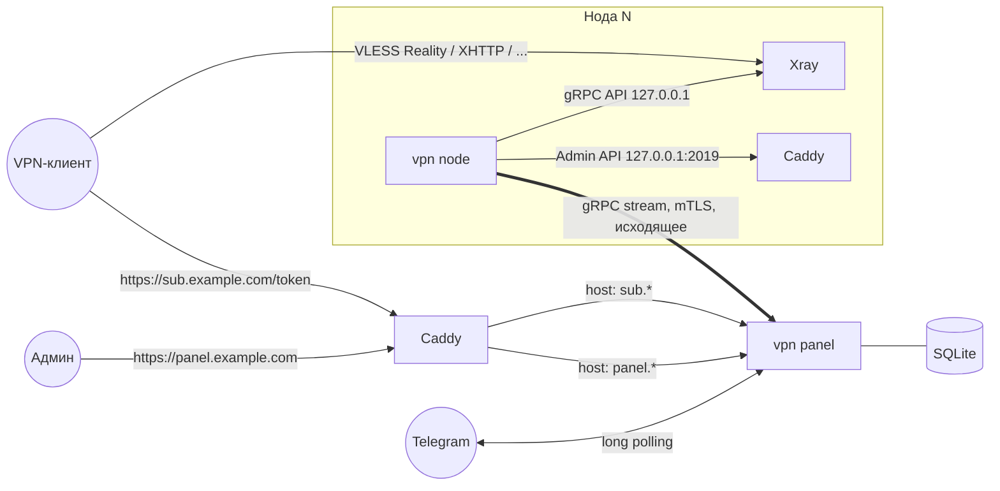

# Архитектура: панель + нода (Xray + Caddy)

Рабочее название: **vpn**. Аналог Remnawave: та же модель (ноды, профили Xray, группы, хосты, шаблоны подписок, HWID), но проще в установке и понятнее в настройке.
Документ описывает логику и архитектуру. Кода пока нет.

Ревизия 3. Решения после обсуждения:

- масштаб — до **15 нод** (SQLite хватает с запасом, Postgres не нужен);
- **HWID-лимиты** есть с первой версии;
- внешнего API для биллинга пока нет, но вся логика живёт в сервисном слое, к которому потом подключается API (§12);
- **панель и подписки на разных доменах**;
- **Telegram-бот только для админов**: создание пользователей, уведомления, ночной полный бэкап и восстановление из него при первом запуске (§10, §11);
- **ролей нет**: все админы равноправны;
- клиент **без `x-hwid` не пускается**, но есть галочка, которая это разрешает (§8.2);
- профили строятся из **шаблонов**, оптимизированных под две рабочие схемы: Reality self-steal и XHTTP через VK CDN. Подробно — в [PROFILES.md](PROFILES.md).

---

## 1. Требования

| # | Требование | Решение |
|---|------------|---------|
| 1 | Установка одной командой | `install.sh` ставит один бинарь, Xray и Caddy, создаёт systemd-юниты и открывает мастер первого запуска |
| 2 | Простая установка ноды | Панель генерирует **страницу-инструкцию по URL** с командой, DNS, портами и живым статусом установки (§6.1) |
| 3 | Панель и нода на одном сервере | Флаг `--with-node`: агент ноды работает внутри процесса панели |
| 4 | Ядро Xray | Профили Xray как в Remnawave, системные секции добавляются автоматически, пользователи меняются без рестарта |
| 5 | Caddy | TLS для панели и подписок, сайт-заглушка и self-steal-цель для Reality, TLS для WS/gRPC/XHTTP |
| 6 | Пользователи и группы | Группы = internal squads. **Шаблоны пользователей**: чтобы создать пользователя, достаточно ввести имя |
| 7 | HWID и типы клиентов | Реестр устройств, лимит на пользователя, правила ответа по User-Agent, ручной тип клиента |
| 8 | Статистика | По нодам, пользователям, устройствам |
| 9 | Telegram-бот | Управление пользователями, алерты, ночной зашифрованный бэкап, восстановление |

---

## 2. Термины (наши ↔ Remnawave)

Модель та же, что в Remnawave, но названия и связи сделаны прозрачнее:

| У нас | В Remnawave | Что это |
|-------|-------------|---------|
| **Нода** | Node | Сервер с агентом и Xray |
| **Профиль Xray** | Config Profile | Шаблон конфига Xray: инбаунды, роутинг, outbounds. Один профиль может работать на нескольких нодах |
| **Инбаунд** | Inbound | Вход внутри профиля (например `vless-reality-443`) |
| **Переменные ноды** | — (нет) | Значения, которые у каждой ноды свои: домен, SNI, порт. Подставляются в профиль, так что профиль не приходится копировать на каждую ноду |
| **Группа** | Internal Squad | Набор инбаундов. Пользователь в группе получает доступ к этим инбаундам на всех нодах, где они включены |
| **Точка подключения** | Host | Строка в подписке: как клиент видит сервер (название, адрес, порт, SNI, fingerprint). Создаётся автоматически, руками только правится |
| **Шаблон пользователя** | — (нет) | Пресет: срок, группы, лимит трафика, лимит HWID, стратегия сброса |
| **Правило ответа** | Response Rules | Какой формат отдать клиенту по User-Agent и заголовкам |
| **Шаблон подписки** | Subscription Template | Тело ответа для формата (Mihomo YAML, sing-box JSON, Xray JSON и т.д.) |

---

## 3. Общая схема



Ключевые решения (не изменились с первой ревизии):

1. **Нода сама подключается к панели.** Это исходящий gRPC-стрим с mTLS на внутреннем CA панели, порт `:9443`. На ноде не нужно открывать управляющий порт, она работает за NAT, а онлайн-статус панель видит по живому стриму.
2. **Панель хранит желаемое состояние (desired state) с ревизиями, нода его применяет.** Без панели нода продолжает работать на последнем снапшоте и копит статистику локально.
3. **Один бинарь `vpn`** на Go: `panel`, `node`, `backup`, `restore`, `admin`, `update`. Веб-интерфейс (React) вшит через `go:embed`.
4. **Один процесс панели обслуживает два домена.** Caddy направляет `panel.*` на внутренний листенер UI/API, а `sub.*` на листенер подписок. Листенеры разные, поэтому через домен подписок UI и API физически недоступны, а через домен панели недоступны подписки.

---

## 4. Компоненты

### 4.1 Панель (`vpn panel`)

```
internal/panel/
  service/        ← ВСЯ бизнес-логика (users, groups, nodes, profiles, hosts, devices, backup)
  events/         ← доменные события + outbox (user.created, node.offline, ...)
  transport/
    webapi/       ← REST для веб-интерфейса (сессия + CSRF)
    bot/          ← Telegram-бот (тот же service)
    publicapi/    ← (позже) внешний API для биллинга, токены со скоупами
  subscription/   ← правила ответа, рендер форматов, HWID-проверка
  gateway/        ← gRPC для нод
  reconciler/     ← desired state → дельты для нод
  scheduler/      ← истечения, сбросы, свёртка статистики, ночной бэкап
  xrayconf/       ← рендер и валидация конфигов Xray (общий код с нодой)
  ca/             ← внутренний CA
  store/          ← SQLite, миграции
```

Главное правило: **транспорты не содержат логики.** Веб, бот и будущий API вызывают одни и те же методы `service.*`. Поэтому API для биллинга добавляется как ещё один тонкий транспорт (§12).

### 4.2 Нода (`vpn node`)

Тонкий агент:

- держит стрим с панелью;
- применяет снапшоты и дельты к Xray;
- пишет `config.json` Xray и JSON-конфиг Caddy, которые прислала панель (рендерит панель, нода ничего не вычисляет);
- снимает статистику и метрики;
- хранит в `/var/lib/vpn-node/state.db` (bbolt) последний снапшот и неотправленную статистику.

### 4.3 Xray

- Это дочерний процесс агента. Gracefull-рестарт нужен только при смене профиля или инбаундов.
- Пользователи меняются через `HandlerService.AlterInbound` без рестарта.
- API Xray слушает только `127.0.0.1`.

### 4.4 Caddy

Управляется через Admin API, Caddyfile руками никто не пишет.

- **На сервере панели:** сертификаты для `panel.*` и `sub.*`, reverse proxy в листенеры панели.
- **На ноде:** сайт-заглушка, self-steal-цель для Reality на `127.0.0.1:8443`, TLS-терминация WS/gRPC/XHTTP.

---

## 5. Модель данных

```
── администрирование ───────────────────────────────────────────────
admins              id, username, password_hash, totp_secret, telegram_id, created_at   -- ролей нет
sessions            id, admin_id, expires_at, ip, ua
audit_log           id, actor(admin|bot|system|api), actor_id, action, entity, entity_id, diff_json, ts
settings            key, value_json          -- домены, HWID-политика, бот, бэкап и т.д.

── xray / ноды ──────────────────────────────────────────────────────
xray_profiles       id, name, base_json,       -- базовый конфиг: log, dns, outbounds, routing (PROFILES.md §2)
                    variables_json,            -- значения переменных scope=profile
                    created_at, updated_at
profile_inbounds    id, profile_id, tag, template_id, template_version,   -- модуль из шаблона (A, B, ...)
                    inbound_json,              -- фрагмент Xray с ${VAR}; правится в режиме «JSON»
                    protocol, port, network, security   -- денормализация для UI и связей
                    -- шаблоны (PROFILES.md) лежат в бинаре, в БД только ссылка, версия и override

nodes               id, name, country_code, address, domain, profile_id,
                    variables_json,           -- значения переменных scope=node (домен, ключи Reality, shortId, CDN-домен)
                    sysctl_state_json,        -- BBR/fq/TFO/время: что агент нашёл на ноде (PROFILES.md §6)
                    status(pending|installing|online|offline|error|disabled),
                    cert_serial, agent_version, xray_version, last_seen_at,
                    traffic_limit_bytes, traffic_used_bytes, traffic_reset_day,
                    desired_revision, applied_revision, sort, created_at
node_inbounds       node_id, inbound_id       -- какие инбаунды профиля включены на этой ноде
node_install_tokens id, node_id, token_hash, expires_at, used_at

hosts               id, node_id, inbound_id,  -- одна точка = (нода × инбаунд)
                    remark, address, port, sni, host, path, alpn, fingerprint,
                    override_json,            -- любые поля поверх автоматически вычисленных
                    hidden, sort, enabled

── пользователи ─────────────────────────────────────────────────────
groups              id, name, description, sort
group_inbounds      group_id, inbound_id

user_templates      id, name, is_default,
                    expire_duration('3 months' | '7 days' | null),
                    traffic_limit_bytes, reset_strategy(no|day|week|month),
                    hwid_limit, client_type, group_ids[], note_template

users               id, username, uuid, ss_password, trojan_password,
                    sub_token,                -- 32 случайных байта, НЕ совпадает с uuid
                    status(active|disabled|limited|expired),
                    expire_at, traffic_limit_bytes, traffic_used_bytes, lifetime_used_bytes,
                    reset_strategy, last_reset_at,
                    hwid_limit (null = из настроек),
                    client_type (auto | happ | v2raytun | clash | singbox | xray-json | ...),
                    template_id, telegram_id, external_id,   -- external_id: для будущего биллинга
                    note, tags[], online_at, sub_last_at, sub_last_ua,
                    created_by(admin|bot|api), created_at, updated_at
user_groups         user_id, group_id
user_devices        id, user_id, hwid, platform, os_version, model, user_agent,
                    first_seen_at, last_seen_at, last_ip

── подписки ─────────────────────────────────────────────────────────
response_rules      id, sort, name, enabled,
                    match_json   -- {ua_regex, headers{...}, client_type}
                    format(base64|mihomo|stash|singbox|xray-json|html|blocked),
                    template_id, extra_headers_json
sub_templates       id, name, format, body, is_builtin

── статистика ──────────────────────────────────────────────────────
user_traffic_hourly user_id, hour_ts, up, down                 -- 7 дней
user_node_daily     user_id, node_id, day, up, down            -- 90 дней
user_traffic_daily  user_id, day, up, down                     -- бессрочно
node_traffic_hourly node_id, hour_ts, up, down                 -- 30 дней, потом daily
node_metrics        node_id, ts, cpu, mem, load1, rx_bps, tx_bps, online   -- 7 дней, прореживание
stats_batches       node_id, seq                               -- идемпотентность

── служебное ──────────────────────────────────────────────────────
events_outbox       id, type, payload_json, created_at, delivered_at   -- для бота и будущих вебхуков
backups             id, created_at, size, sha256, sent_to_telegram, error
```

Расчёт объёма для 15 нод и ~5000 пользователей. Почасовая статистика хранится без разбивки по нодам (так строка не умножается на 15), разбивка по нодам — только по дням. Это ~1–2 млн строк. SQLite справляется, бэкап остаётся в пределах нескольких МБ после сжатия (§11).

---

## 6. Добавление сервера: мастер из трёх шагов

Это главный сценарий в UI. Шаги можно проходить, пока нода ещё ставится.

### 6.1 Шаг 1 — Нода и инструкция по URL

Админ вводит:
- **название и страну** (флаг пойдёт в название точки подключения);
- **IP**;
- **домен ноды** (необязательно, нужен для Reality self-steal, по умолчанию предлагается).

Панель создаёт ноду в статусе `pending`, выпускает install-токен (одноразовый, живёт 24 часа) и показывает ссылку:

```
https://panel.example.com/install/9fK2...xQ
```

Это **публичная страница-инструкция** (токен в URL — единственный ключ доступа). Её можно открыть на телефоне или отправить человеку, который ставит сервер. На странице:

1. **Требования:** ОС (Debian 11+/Ubuntu 22.04+, x86_64/arm64), минимум 512 МБ RAM.
2. **DNS:** «создайте A-запись `de1.example.com → 203.0.113.10`». Страница сама проверяет запись и показывает ✓/✗.
3. **Порты:** `443/tcp`, `80/tcp` (для ACME), плюс порты других инбаундов профиля. Если найден ufw или firewalld, команда откроет их сама.
4. **Команда установки**, одна строка:

   ```bash
   curl -fsSL https://panel.example.com/install/9fK2...xQ/node.sh | sudo bash
   ```

   В скрипт уже вшиты URL панели, отпечаток внутреннего CA (pinning) и токен.
5. **Живой статус** (SSE), чеклист по мере установки:
   `☐ скрипт запущен → ☐ Xray и Caddy установлены → ☐ нода зарегистрирована → ☐ конфиг применён → ☐ сертификат получен → ☐ порт 443 доступен снаружи (проверка с панели)`.
6. **Если что-то пошло не так:** типовые ошибки, команды `vpn node doctor` и `journalctl -u vpn-node`.

Что делает `node.sh`:
1. Проверяет ОС, порты и время (рассинхрон часов ломает Reality).
2. Скачивает `vpn`, `xray`, `caddy`, сверяет sha256.
3. Генерирует ключ и отправляет CSR с токеном в `POST /api/node/join`, получает сертификат.
4. Создаёт systemd-юнит `vpn-node` и запускает его. Агент подключается к стриму и получает снапшот.
5. По ходу шлёт прогресс в панель (`/install/{token}/progress`), из него строится чеклист на странице.

Повторный запуск той же команды после использования токена недопустим. Чтобы переустановить ноду, в панели нажимается «Перевыпустить инструкцию»: старый сертификат отзывается, создаётся новый токен.

### 6.2 Шаг 2 — Профиль Xray (основной конфиг)

Админ выбирает **существующий профиль** или **создаёт новый из шаблонов**. Профиль = базовый конфиг + модули-инбаунды из шаблонов. Подробно все шаблоны, их технические характеристики, Caddy, проверки и lint описаны в [PROFILES.md](PROFILES.md).

| Шаблон | Что вводит админ | Что внутри |
|--------|------------------|-----------|
| **A. VLESS Reality self-steal** (основной) | ничего: домен берётся из ноды | `raw` + Reality на `:443`, target = Caddy `127.0.0.1:8443` с сайтом-заглушкой, vision, BBR. Ключи и shortId генерируются на ноду |
| **B. VLESS XHTTP через VK CDN** | `ORIGIN_DOMAIN`, `CDN_DOMAIN` | XHTTP packet-up на `127.0.0.1:8085`, данные в куках, набивка в query, Caddy вместо nginx+certbot, внешние шаги VK Cloud на странице-инструкции |
| **A + B** на одной ноде | то же | Оба на одном `:443`: Reality отдаёт «чужой» трафик (включая edge VK) в Caddy, тот разводит по SNI |

Как устроен профиль:

- Это **обычный JSON Xray**. Его можно редактировать в Monaco-редакторе с подсветкой и автодополнением тегов, как в Remnawave.
- **Системные секции добавляются автоматически и в редакторе не видны**: `api`, `stats`, `policy` со `statsUser*` и `statsUserOnline`, API-инбаунд `127.0.0.1`, правило роутинга для API. Админ не может их сломать или забыть.
- **`clients` в инбаундах пишутся пустыми**, пользователей подставляет панель.
- **Переменные** со scope `profile` или `node`: `${NODE_DOMAIN}`, `${REALITY_PRIVATE_KEY}`, `${CDN_DOMAIN}` и т.д. Значения уровня ноды свои на каждой ноде, поэтому один профиль «Reality self-steal» используется на всех 15 нодах, а не 15 копий `NL`/`DE`, как в Remnawave.
- **Генераторы:** x25519 и shortId генерируются автоматически при подключении ноды к профилю, у каждой ноды свои (компрометация одной ноды не раскрывает остальные). Публичный ключ вычисляется и попадает в подписку сам. Перегенерировать можно кнопкой.
- **Lint шаблонов** ловит типовые ошибки до применения: вложенный `extra` в XHTTP, рассинхрон пути или `extra` между инбаундом и точкой подключения и т.д. (PROFILES.md §4.8).
- **Валидация перед сохранением:** панель рендерит итоговый конфиг для каждой ноды профиля и прогоняет `xray run -test` (бинарь Xray есть на сервере панели). Ошибка показывается с указанием ноды и строки.
- **Общий роутинг:** блок приватных IP, BitTorrent (опционально), `geosite`/`geoip`. Задаётся пресетами-галочками, которые превращаются в JSON.

На этом шаге отмечается, **какие инбаунды профиля включены на этой ноде**, и заполняются переменные ноды. Домен подставляется из шага 1.

Сохранение профиля поднимает ревизию у всех его нод. Ноды получают `ApplyConfig` и делают graceful-рестарт Xray.

### 6.3 Шаг 3 — Точки подключения (что увидит клиент)

Для каждой пары «нода × включённый инбаунд» **точка подключения создаётся автоматически**. Поля вычисляются сами:

| Поле | Откуда берётся |
|------|-----------|
| Название | `{флаг} {название ноды}`, например «🇩🇪 Германия» (шаблон настраивается) |
| Адрес | домен ноды, если он есть, иначе IP |
| Порт | порт инбаунда |
| SNI, publicKey, shortId, flow | из инбаунда и переменных ноды |
| Fingerprint | `chrome` (глобальная настройка) |

Админ видит **итоговый результат**, а не набор полей:
- `vless://` ссылку и QR;
- как точка будет выглядеть в списке Happ/v2RayTun (название, флаг, порядок);
- кусок конфига Mihomo и sing-box.

Правка любого поля сохраняется в `override_json` и подсвечивается как «изменено вручную» с кнопкой «вернуть авто». Это главное отличие от Remnawave: там хост заполняется руками с нуля, и легко ошибиться в SNI или ключе.

Здесь же выбирается, **каким группам доступен инбаунд**. Галочки групп меняют `group_inbounds`, то есть доступ выдаётся на уровне инбаунда во всех его нодах, как squads в Remnawave. Предупреждение показывается, если инбаунд не входит ни в одну группу.

Также есть `hidden` (точка есть, но в подписке не показывается) и порядок сортировки drag-n-drop.

### 6.4 Финал мастера

Сводка состояния:

`агент онлайн ✓ · Xray запущен ✓ · 443 доступен ✓ · сертификат ✓ · самотест ✓`

**Самотест**: панель создаёт скрытого служебного пользователя, поднимает локальный Xray-клиент, делает запрос через ноду (`https://www.gstatic.com/generate_204`), измеряет задержку и удаляет пользователя. Ответ на вопрос «работает ли сервер на самом деле», а не только «запущен ли процесс».

---

## 7. Пользователи

### 7.1 Шаблоны: создание по одному имени

- Шаблон пользователя — это пресет: `срок (+3 месяца)`, `группы [Основная]`, `трафик (безлимит / 200 ГБ)`, `сброс (ежемесячно)`, `HWID-лимит (3)`, `тип клиента (auto)`.
- Один шаблон помечен **по умолчанию**. В форме «Новый пользователь» видно только поле «Имя», остальное взято из шаблона и свёрнуто в блок «Параметры (из шаблона «Стандарт»)», который можно развернуть и поменять.
- Можно завести несколько шаблонов: «Стандарт 3 мес», «Пробный 3 дня», «Семья, 5 устройств». В форме они переключаются одной кнопкой.
- Шаблон применяется **один раз при создании**: значения копируются в пользователя. Если позже изменить шаблон, существующие пользователи не меняются. `template_id` сохраняется только для информации и фильтров.
- Продление в UI и боте делается кнопками `+1 мес`, `+3 мес`, `+1 год`. Отсчёт идёт от `max(now, expire_at)`, чтобы не терять оплаченные дни.

### 7.2 Статусы

```
 active ──(трафик ≥ лимит)──► limited ──(сброс / новый лимит)──► active
   ├────(now ≥ expire_at)───► expired ──(продление)────────────► active
   └────(админ)─────────────► disabled ──(админ)───────────────► active
```

В конфиг Xray попадают только `active`. Смена статуса вызывает reconciler, и тот рассылает `RemoveUser`/`UpsertUser` по нужным нодам.

### 7.3 Доступ

Эффективные инбаунды пользователя = объединение `group_inbounds` по всем его группам. Нода получает пользователя, если хотя бы один из этих инбаундов на ней включён.

---

## 8. Подписки, HWID, типы клиентов

### 8.1 Обработка запроса

`GET https://sub.example.com/{sub_token}`, опционально `/{sub_token}/{format}`.

```
1. найти пользователя по sub_token                    → нет: 404
2. определить клиента:
     a) явный формат в URL                              (/token/clash)
     b) user.client_type ≠ auto                         (ручной тип клиента у пользователя)
     c) правила ответа по порядку: UA regex + заголовки
     d) fallback: base64
3. HWID-проверка (§8.2)                                → отказ: ответ-заглушка в формате клиента
4. статус пользователя ≠ active                        → заглушка «подписка истекла / трафик исчерпан»
5. собрать точки подключения: группы → инбаунды → (нода × инбаунд) → hosts (enabled, !hidden)
                               только ноды не в статусе disabled
6. отрендерить шаблон формата
7. заголовки: subscription-userinfo, profile-title, profile-update-interval,
              support-url, profile-web-page-url + extra_headers из правила (например announce для Happ)
8. обновить sub_last_at, sub_last_ua; событие subscription.fetched
```

Заглушка — это валидная подписка с одним фиктивным сервером, в названии которого текст ошибки («⛔ Лимит устройств: 3/3»). Так человек видит причину прямо в клиенте, а не пустой список.

### 8.2 HWID (как в Remnawave)

Клиенты (Happ, v2RayTun, INCY, Streisand и др.) присылают заголовки:
`x-hwid`, `x-device-os`, `x-ver-os`, `x-device-model`, `User-Agent`.

Логика:

```
если HWID глобально выключен → пропустить
limit = user.hwid_limit ?? settings.hwid_default_limit   (0 = без лимита)
если нет x-hwid:
    по умолчанию → отказ «клиент не поддерживает HWID»
    галочка «Пускать клиентов без HWID» (settings.hwid_allow_missing) → пропустить без учёта устройства
если устройство с этим hwid уже есть → обновить last_seen, ip, ua → ок
иначе если count(devices) < limit → добавить устройство → событие device.added → ок
иначе → отказ «лимит устройств» → событие device.limit_reached
```

- Устройства видны в карточке пользователя (модель, ОС, когда последний раз обновлялся) и в боте. Удаление устройства освобождает слот.
- Опционально: автоудаление устройств, которые не обновляли подписку N дней.
- **Важное ограничение:** HWID работает на уровне выдачи подписки. Xray про устройства ничего не знает, поэтому скопированную `vless://` ссылку HWID не остановит. Дополнительный сигнал — счётчик одновременных IP из статистики Xray (§9): показываем его рядом и можем алертить в бот, если IP больше лимита устройств.

### 8.3 Правила ответа и тип клиента

- Встроенный набор правил (редактируемый) задаёт формат по User-Agent:

  | Клиент | Формат |
  |--------|--------|
  | Happ, v2RayTun, v2rayN/NG, Streisand, Hiddify, INCY | base64 (+ спец-заголовки для Happ) |
  | Clash Verge, Mihomo, FlClash, Clash Meta for Android | Mihomo YAML |
  | Stash | Stash YAML |
  | sing-box, SFA, SFI, Karing | sing-box JSON |
  | Xray-клиенты, которые понимают полный JSON | Xray JSON |
  | Браузер (`Accept: text/html`) | HTML-страница |
  | Неизвестный | base64 |

- **Тип клиента у пользователя** (`client_type`) — ручной оверрайд, когда клиент не определяется по UA или человеку нужен конкретный формат. Ставится в карточке, в шаблоне или из бота.
- **Шаблоны подписок** — тело ответа для каждого формата (Go templates). Встроенные можно склонировать и править: DNS, правила роутинга для Mihomo и sing-box и т.д. Предпросмотр рендерится под выбранного пользователя.

### 8.4 HTML-страница подписки

QR-код, кнопки «Добавить в Happ / v2RayTun / Hiddify» (deep links), остаток трафика и срок, инструкции по платформам, список устройств (без возможности удалить, только просмотр).

---

## 9. Статистика

Без изменений по механике с первой ревизии.

- **Нода, каждые 10–15 секунд:**
  - `QueryStats(reset=true)` даёт прирост трафика по пользователям, инбаундам и outbounds;
  - список онлайн-IP;
  - CPU, RAM и сеть.

  Всё складывается в пачку `StatsBatch{seq}` в локальной очереди и удаляется только после `Ack(seq)`.
- **Панель:** одна транзакция на пачку. Повторы отсекаются по `(node_id, seq)`. Счётчики пользователя обновляются, строки раскладываются в почасовые и дневные агрегаты, затем проверяются лимиты.

Что показываем:
- **пользователь:** трафик и лимит, график по дням, разбивка по нодам, онлайн сейчас, одновременные IP, устройства HWID, последний клиент;
- **нода:** статус, аптайм, CPU/RAM/сеть, онлайн, трафик за период и относительно лимита хостера, версии агента и Xray, последние ошибки Xray;
- **дашборд:** пользователи по статусам, онлайн, трафик за день/неделю/месяц, топ пользователей, истекающие в ближайшие 3 дня.

---

## 10. Telegram-бот

Встроен в процесс панели и работает через long polling: входящий вебхук не нужен, это проще за Reality и NAT. Настраивается в панели: токен бота, список админов (telegram_id привязан к `admins`; бот отвечает только им, все с полными правами), чат для бэкапов и алертов.

### 10.1 Управление пользователями

```
/new                → «Имя?» → вася
                     ✅ Создан vasya (шаблон «Стандарт»: до 06.01.2027, группа Основная, 3 устройства)
                     [QR] [Ссылка] [Шаблон ▾] [Группы] [+1 мес]
/new vasya          → то же одним сообщением
/new vasya trial    → с шаблоном «Пробный»
/find vas           → список совпадений → карточка
```

Карточка пользователя (inline-кнопки):
`[+1 мес] [+3 мес] [Сбросить трафик] [Устройства (2/3)] [Тип клиента] [Вкл/Выкл] [Новая ссылка] [QR]`

- «Устройства» — список с кнопкой удаления у каждого.
- «Новая ссылка» перевыпускает `sub_token` (старая ссылка перестаёт работать).

Прочее: `/nodes` (статусы и онлайн), `/stats` (сводка), `/expiring` (истекают в ближайшие дни), `/backup` (бэкап сейчас).

Все действия идут через `service.*` и пишутся в `audit_log` с `actor=bot`.

### 10.2 Уведомления

Бот подписан на `events_outbox`:
- нода офлайн или снова онлайн, ошибка применения конфига;
- нода близка к лимиту трафика хостера;
- превышение одновременных IP;
- ежедневная сводка (вместе с бэкапом): новые и истёкшие пользователи, трафик за сутки;
- ошибка бэкапа.

Набор уведомлений настраивается.

---

## 11. Бэкап и восстановление

### 11.1 Что входит в бэкап

Файл `vpn-backup-2026-10-06T03-00.vpnbak` — это архив `tar + zstd`, **зашифрованный** (`age`, ключ из passphrase через scrypt):

```
manifest.json      версия vpn, версия схемы БД, дата, домены панели/подписок, список нод, sha256 файлов
db.sqlite          VACUUM INTO — консистентный снимок без остановки панели
secrets/
  ca.key, ca.crt   внутренний CA (с ним ноды переподключаются к восстановленной панели без переустановки)
  app.key          ключ подписи сессий и шифрования секретов в БД
caddy/             (опц.) сертификаты, чтобы не упереться в лимиты Let's Encrypt
```

Шифрование обязательно: в бэкапе приватный ключ CA, ключи Reality и uuid всех пользователей, а файл уходит в Telegram. Passphrase задаётся в мастере первого запуска и **не хранится в бэкапе**. Её нужно записать.

### 11.2 Ночная отправка

- Scheduler в заданное время (по умолчанию 03:00 по времени панели) делает бэкап и отправляет его ботом документом в чат бэкапов вместе с короткой сводкой.
- Локально хранятся последние 7 бэкапов в `/var/lib/vpn/backups`.
- **Размер:** Bot API позволяет загрузить 50 МБ и скачать 20 МБ. Для 15 нод и тысяч пользователей сжатый бэкап укладывается в единицы МБ, потому что почасовая статистика хранится без разбивки по нодам (§5). Если бэкап всё же больше 20 МБ, из него исключается почасовая статистика (режим `compact`, дневные агрегаты остаются). Если больше 50 МБ, файл делится на части.

### 11.3 Восстановление при первом запуске

Установщик панели не создаёт админа сам. Он печатает **одноразовую ссылку мастера первого запуска**:

```
https://panel.example.com/setup/Qm7...   (действует до завершения настройки)
```

Мастер предлагает:

1. **Новая установка** — админ, пароль, passphrase бэкапов, (опц.) бот.
2. **Восстановить из бэкапа:**
   - загрузить `.vpnbak` в браузере, **или**
   - указать токен бота и переслать ему файл бэкапа: бот скачивает его через `getFile` (до 20 МБ);
   - ввести passphrase.

Также есть консольный путь для автоматизации:

```bash
bash <(curl -fsSL https://.../install.sh) panel --panel-domain panel.example.com \
     --sub-domain sub.example.com --restore ./vpn-backup.vpnbak
```

Что происходит при восстановлении:

1. Расшифровка, проверка sha256 и версии схемы. Если бэкап от более старой версии, применяются миграции.
2. Восстанавливаются БД, CA и ключи.
3. Домены берутся из бэкапа (можно поменять в мастере), Caddy получает сертификаты.
4. Если панель стояла в режиме `--with-node`, локальная нода поднимается автоматически.
5. **Внешние ноды:** если домен панели тот же (DNS перенаправлен на новый сервер), ноды переподключаются сами — CA тот же, а их сертификаты в бэкапе валидны. Если домен другой, в панели для каждой ноды показывается команда `vpn node set-panel https://new-panel.example.com`, а бот присылает этот список.
6. Ноды присылают свои `applied_revision`, панель отдаёт полные снапшоты, состояние сходится.
7. Статистика, которая накопилась на нодах в локальных очередях за время простоя панели, доезжает. Трафик не теряется.

---

## 12. Задел под API для биллинга

Сейчас не делаем, но архитектура не мешает:

- **Сервисный слой.** Методы `service.Users.Create(ctx, CreateUserInput{Username, TemplateID, ...})`, `Extend`, `ResetTraffic`, `SetGroups` и т.д. уже есть и используются вебом и ботом. API — это ещё один транспорт `transport/publicapi`, без новой логики.
- **`external_id`** у пользователя — для связи с аккаунтом в биллинге.
- **Идемпотентность.** Методы создания и продления принимают необязательный `idempotency_key` (в веб-интерфейсе не используется). Повтор оплаты не продлит подписку дважды.
- **Акторы.** `audit_log.actor` уже поддерживает `api`.
- **События.** `events_outbox` уже пишется (для бота). Вебхуки биллингу — это ещё один подписчик outbox.
- **Авторизация.** Таблица API-токенов со скоупами добавляется одной миграцией. Middleware авторизации общее для транспортов.

---

## 13. Совмещение панели и ноды на одном сервере

`install.sh panel --with-node`. Агент работает внутри процесса панели через in-memory транспорт и в БД выглядит как обычная нода с `local = true`.

Порты при отдельном домене подписок:

```
:443  → Xray (VLESS Reality, dest = 127.0.0.1:8443, serverNames = [panel.example.com])
          ├─ валидный Reality-клиент → прокси
          └─ всё остальное         → Caddy 127.0.0.1:8443
                                       ├─ panel.example.com → листенер UI/API
                                       ├─ sub.example.com   → листенер подписок
                                       └─ прочее            → сайт-заглушка
:80   → Caddy (ACME HTTP-01, редирект)
:9443 → gRPC для внешних нод (mTLS)
```

Сертификаты для `panel.*` и `sub.*` выпускаются через HTTP-01 на `:80`, поэтому то, что `:443` занят Xray, не мешает.

---

## 14. Протокол панель ↔ нода (черновик)

```proto
service NodeGateway {
  rpc Join(JoinRequest) returns (JoinResponse);        // install-токен + CSR → сертификат + CA
  rpc ReportInstall(InstallProgress) returns (Empty);  // прогресс для страницы-инструкции
  rpc Connect(stream NodeMessage) returns (stream PanelMessage);   // mTLS
}

NodeMessage  = Hello{agent_ver, xray_ver, applied_revision, os, arch}
             | Ack{revision, error?}
             | StatsBatch{seq, ts, user_deltas[], inbound_deltas[], online_ips[]}
             | Metrics{cpu, mem, load, rx_bps, tx_bps}
             | LogEvent{level, source(xray|caddy|agent), msg}
             | SelfTestResult{id, ok, latency_ms, error?}

PanelMessage = Snapshot{revision, xray_config, caddy_config, users_by_inbound}
             | Delta{from_rev, to_rev, ops[Upsert/RemoveUser]}
             | StatsAck{seq}
             | Command{restart_xray | update_agent | fetch_logs | self_test}
```

---

## 15. Безопасность

- Админы: argon2id, TOTP, rate-limit логина. Сессии в БД, их можно отозвать.
- Панель и подписки на разных доменах и листенерах: утечка домена подписок не раскрывает панель. Для панели есть опциональный allowlist IP.
- Ноды: mTLS на внутреннем CA. Сертификат отзывается при удалении или переустановке ноды. Install-токен одноразовый, живёт 24 часа и хранится хэшем.
- Xray API и Caddy Admin API доступны только с `127.0.0.1`.
- `sub_token` ≠ `uuid`, и то, и другое перевыпускается.
- Бот отвечает только telegram_id из списка админов, остальные сообщения игнорируются молча.
- Бэкап всегда зашифрован, passphrase хранится вне бэкапа.
- `audit_log` фиксирует все изменения, кто бы их ни сделал: веб, бот или система.

---

## 16. Установка панели

```bash
bash <(curl -fsSL https://raw.githubusercontent.com/vyto4ka/vpn/main/install.sh) panel \
     --panel-domain panel.example.com --sub-domain sub.example.com [--with-node] [--restore file]
```

Шаги установщика:
1. Проверки: ОС, порты, оба домена резолвятся на этот IP, время.
2. Скачивание `vpn`, `xray`, `caddy` со сверкой sha256.
3. Каталоги, systemd-юниты, миграции, внутренний CA.
4. Печать ссылки мастера первого запуска.

Повторный запуск установщика обновляет систему. Есть также `vpn update`, `vpn backup`, `vpn restore`, `vpn admin reset-password`.

Стек: Go, `chi`, `grpc-go`, `goose`, `modernc.org/sqlite`, `filippo.io/age`, `go-telegram/bot`, gRPC-клиенты `xtls/xray-core`; фронтенд на React, Vite, TanStack Query, shadcn/ui и Monaco.

---

## 17. Этапы

1. **MVP**
   - установщик, мастер первого запуска, SQLite, админ;
   - мастер добавления сервера: нода с инструкцией по URL, профиль из шаблонов **A (Reality self-steal)** и **B (XHTTP через VK CDN)**, в том числе A+B на одной ноде, JSON-редактор, переменные, lint; автоматические точки подключения;
   - системная подготовка ноды: BBR, fq, TFO, время;
   - режим `--with-node`;
   - группы, шаблоны пользователей, создание по имени, продление;
   - статистика, дашборд;
   - подписки: base64, Mihomo, sing-box, HTML; правила ответа, тип клиента; HWID;
   - бот: `/new`, `/find`, карточка, ночной бэкап, восстановление из бэкапа.
2. **v1**
   - шаблоны Reality «чужой сайт», Trojan, SS-2022, WARP outbound;
   - Stash и Xray JSON; редактор шаблонов подписок;
   - самотест нод, алерты в бот, 2FA, лимиты трафика хостера на нодах.
3. **Потом**
   - публичный API и вебхуки для биллинга (§12);
   - автообновление агентов из панели;
   - XHTTP через другие CDN.

## 18. Закрытые вопросы

- Бот — только для админов. Клиентского бота нет.
- Ролей нет.
- Без `x-hwid` клиент не пускается; есть галочка, которая это отменяет.
