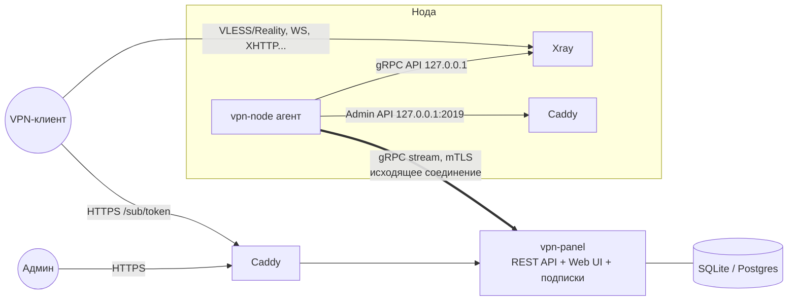

# Архитектура: панель + нода (Xray + Caddy)

Рабочее название: **vpn** (панель — `vpn-panel`, нода — `vpn-node`).
Документ описывает логику и архитектуру. Кода пока нет.

## 1. Требования (из ТЗ)

| # | Требование | Как закрываем |
|---|------------|---------------|
| 1 | Установка одной командой | `install.sh` ставит один бинарь + Xray + Caddy + systemd-юниты |
| 2 | Простая установка ноды | В панели «Добавить ноду» → готовая команда с одноразовым токеном, нода сама регистрируется |
| 3 | Панель и нода на одном сервере | Режим `panel --with-node`: агент ноды встроен в процесс панели |
| 4 | Ядро Xray | Агент управляет Xray как дочерним процессом, пользователи — через gRPC API Xray без рестарта |
| 5 | Caddy | TLS/ACME для панели и подписок, сайт-заглушка и self-steal цель для Reality, TLS для WS/gRPC/XHTTP |
| 6 | Пользователи и группы | Группа = набор инбаундов + дефолтные лимиты; доступ пользователя = объединение групп |
| 7 | Статистика по нодам и юзерам | Агент снимает дельты из Xray Stats API, буферизует, отправляет в панель; агрегаты по часам/дням |

## 2. Общая схема



Ключевые решения:

1. **Нода сама подключается к панели** (исходящий долгоживущий gRPC bidi‑stream, mTLS).
   - На ноде не нужно открывать управляющий порт наружу, работает за NAT.
   - Панель видит онлайн/офлайн ноды по факту живого стрима.
   - Панель слушает отдельный порт для нод (по умолчанию `:9443`), TLS терминирует сама панель внутренним CA (не Caddy).
2. **Панель — источник истины (desired state)**, нода — исполнитель. Нода хранит у себя последний применённый снапшот и умеет жить без панели (VPN продолжает работать, статистика копится локально).
3. **Один бинарь `vpn`** с подкомандами `panel`, `node`, `install`, `admin` и т.д. Go, статическая сборка, фронтенд вшит через `go:embed`.

## 3. Компоненты

### 3.1 Панель (`vpn panel`)

Модули:

- **API** — REST/JSON (`/api/v1/...`), используется и веб‑интерфейсом, и внешними интеграциями (бот, биллинг). Авторизация: сессия (cookie) для UI, Bearer API‑токены со скоупами для интеграций.
- **Web UI** — SPA (React + Vite + TanStack Query), вшит в бинарь.
- **Subscription service** — `GET /sub/{token}`, отдаёт конфиги под клиента (см. §7).
- **Node gateway** — gRPC‑сервер для нод: регистрация, стрим команд, приём статистики и метрик.
- **Reconciler** — пересчитывает desired state для каждой ноды при изменениях пользователей/групп/инбаундов и рассылает дельты.
- **Scheduler** — периодические задачи: истечение подписок, сброс трафика (день/неделя/месяц), ротация агрегатов статистики, бэкап БД.
- **Internal CA** — выпускает сертификаты нодам, отзывает при удалении ноды.

### 3.2 Нода (`vpn node`)

Агент — тонкий, без своей логики над пользователями:

- поддерживает стрим с панелью (reconnect с экспоненциальным backoff);
- применяет снапшоты/дельты к Xray;
- генерирует `config.json` Xray и конфиг Caddy из присланных инбаундов;
- снимает статистику и системные метрики, отправляет в панель;
- хранит локально (`/var/lib/vpn-node/state.db`, bbolt):
  - последний применённый снапшот + ревизию,
  - неотправленные пачки статистики.

### 3.3 Xray

- Запускается агентом как дочерний процесс (или отдельный systemd‑юнит, которым агент управляет).
- API (`HandlerService`, `StatsService`) слушает только `127.0.0.1`.
- Конфиг: `stats {}`, `policy.levels.0.statsUserUplink/Downlink = true`, `statsUserOnline = true`, `policy.system.statsInbound*/Outbound*`.
- Добавление/удаление пользователя: `HandlerService.AlterInbound(AddUserOperation/RemoveUserOperation)` — **без рестарта**, существующие соединения других юзеров не рвутся.
- Изменение структуры инбаундов (порт, транспорт, ключи Reality) — перегенерация конфига и рестарт Xray (редкая операция).

### 3.4 Caddy

Caddy управляется через Admin API (`127.0.0.1:2019`, JSON‑конфиг), без ручного Caddyfile.

На **панели**:
- автоматический TLS (ACME) для домена панели и домена подписок;
- reverse proxy на `vpn panel` (HTTP на `127.0.0.1`).

На **ноде**:
- сайт‑заглушка (статичная страница) со своим доменом и настоящим сертификатом;
- цель для **Reality self‑steal**: Xray слушает `:443`, `dest` = Caddy на `127.0.0.1:8443` → любой «не наш» TLS‑клиент получает живой сайт с валидным сертификатом этого же домена;
- TLS‑терминация для транспортов WS / gRPC / XHTTP (Caddy на `:443` → `reverse_proxy` в Xray по пути) — для CDN‑сценариев.

## 4. Совмещение панели и ноды на одном сервере

Режим `vpn panel --with-node` (ставится флагом установщика).

- Агент ноды работает **в том же процессе**, транспорт до панели — in‑memory (тот же интерфейс, что и gRPC‑стрим, без mTLS). В БД это обычная нода с флагом `local = true`.
- Конфликт порта 443 решаем схемой self‑steal:

```
:443  → Xray (VLESS+Reality, serverNames = [panel.example.com])
          ├─ валидный Reality‑клиент → проксируется
          └─ всё остальное (браузер)  → dest 127.0.0.1:8443 → Caddy
                                                       ├─ panel.example.com → vpn panel (UI/API/sub)
                                                       └─ иначе → сайт‑заглушка
:80   → Caddy (ACME HTTP‑01 + редирект на https)
:9443 → vpn panel (gRPC для внешних нод, mTLS)
```

  Т.е. панель открывается по `https://panel.example.com` как обычно, а этот же домен служит маскировкой для Reality.
- Альтернатива (если нужны несколько TLS‑инбаундов на 443): Caddy с модулем `layer4` впереди, SNI‑роутинг. Оставляем на потом.

## 5. Модель данных

```
admins            id, username, password_hash(argon2id), totp_secret, role(superadmin|admin|viewer), created_at
api_tokens        id, name, token_hash, scopes[], expires_at, last_used_at

nodes             id, name, address, country_code, tags[], local(bool),
                  status(pending|online|offline|error|disabled), cert_serial,
                  xray_version, agent_version, last_seen_at,
                  traffic_limit_bytes, traffic_used_bytes, traffic_reset_day,   -- лимит трафика сервера у хостера
                  applied_revision, created_at
node_join_tokens  id, node_id, token_hash, expires_at, used_at

inbounds          id, node_id, tag, protocol(vless|vmess|trojan|shadowsocks|hysteria2?),
                  port, network(tcp|ws|grpc|xhttp), security(reality|tls|none),
                  settings_json  -- reality privateKey/shortIds/serverNames, flow, path...
                  enabled
hosts             id, inbound_id, remark, address, port, sni, host, path, alpn, fingerprint,
                  sort, enabled   -- что именно попадёт в подписку (адрес может быть CDN/IP и т.д.)

groups            id, name, description,
                  default_traffic_limit_bytes, default_reset_strategy, default_expire_days, default_device_limit
group_inbounds    group_id, inbound_id

users             id, username, uuid (xray id), password (для trojan/ss),
                  sub_token (случайный, для /sub), status(active|disabled|limited|expired),
                  traffic_limit_bytes (null = безлимит), traffic_used_bytes, lifetime_used_bytes,
                  reset_strategy(no|day|week|month), last_reset_at,
                  expire_at (null = бессрочно), device_limit,
                  telegram_id, email, note, tags[],
                  online_at, sub_updated_at, sub_last_user_agent,
                  created_at, updated_at
user_groups       user_id, group_id

user_traffic_hourly   user_id, node_id, hour_ts, up_bytes, down_bytes      -- PK(user,node,hour)
user_traffic_daily    user_id, node_id, day, up_bytes, down_bytes
node_traffic_hourly   node_id, hour_ts, up_bytes, down_bytes
node_metrics          node_id, ts, cpu, mem_used, mem_total, load1, net_rx_bps, net_tx_bps, online_users
stats_batches         node_id, seq  -- для идемпотентности приёма статистики

audit_log         id, admin_id|api_token_id, action, entity, entity_id, diff_json, ts
settings          key, value_json   -- домен подписки, шаблоны, названия профиля и т.д.
```

БД: **SQLite (WAL)** по умолчанию — ноль зависимостей, бэкап = копия файла. Postgres как опция для больших инсталляций. Доступ к БД через слой репозиториев, миграции `goose`.

## 6. Логика

### 6.1 Пользователи и группы

- Группа — это «тариф/набор серверов»: список инбаундов (на разных нодах) + дефолтные значения лимитов.
- Пользователь может состоять в нескольких группах. Эффективный доступ = **объединение** инбаундов всех групп.
- Лимиты/срок хранятся на пользователе (дефолты группы применяются при создании; изменение группы не перезаписывает индивидуальные значения).
- Статус пользователя — вычисляемый автомат:

```
            ┌────────── админ ──────────┐
            ▼                           │
 active ──(used ≥ limit)──► limited ────┤
   │  ▲                       │ (сброс трафика / увеличение лимита)
   │  └───────────────────────┘
   ├──(now ≥ expire_at)─────► expired ──(продление)──► active
   └──(админ)───────────────► disabled ──(админ)─────► active
```

  Только `active` пользователи попадают в конфиг Xray.
- Массовые операции: продлить/сбросить трафик/сменить группу/отключить по фильтру.
- Перевыпуск ключей: новый `uuid` и/или новый `sub_token` (на случай утечки).

### 6.2 Синхронизация панель → нода (desired state)

- У каждой ноды есть `revision` (монотонный счётчик) desired state.
- Любое изменение (юзер, группа, инбаунд) → reconciler вычисляет затронутые ноды и формирует операции:
  - `UpsertUser{inbound_tag, user}` / `RemoveUser{inbound_tag, email}` — горячо, через Xray API;
  - `ApplyConfig{inbounds, caddy}` — полная перегенерация, рестарт Xray.
- Сообщение несёт `from_revision → to_revision`. Нода применяет, отвечает `Ack{revision}`.
- Если нода переподключилась или ревизии не совпали → панель шлёт **полный снапшот** (список инбаундов + всех активных юзеров ноды). Нода сравнивает с текущим состоянием и применяет разницу.
- Изменения дебаунсятся (~1 c), чтобы массовые операции уходили одной пачкой.
- В Xray пользователь идентифицируется по `email = user.id` (стабильный ключ для статистики, не зависит от переименования).

### 6.3 Статистика

На ноде (каждые 10–15 с):
1. `StatsService.QueryStats(pattern="user>>>", reset=true)` → дельты up/down по каждому юзеру.
2. Аналогично для `inbound>>>` / `outbound>>>` (трафик ноды).
3. `GetStatsOnlineIpList` / `user>>>...>>>online` → кто онлайн и сколько IP.
4. Системные метрики (CPU, RAM, сеть, load).
5. Всё складывается в пачку `StatsBatch{seq, ts, deltas[], online[], metrics}` → в локальную очередь (bbolt) → отправка в панель. Удаляется из очереди только после `Ack(seq)`.
   Если панель недоступна — копится локально, трафик не теряется.

На панели (в одной транзакции на пачку):
1. Проверка `(node_id, seq)` в `stats_batches` — дубликаты игнорируются (доставка at‑least‑once → обработка идемпотентная).
2. `users.traffic_used_bytes += delta`, `lifetime_used_bytes += delta`, `online_at = now`.
3. Upsert в `user_traffic_hourly`, `node_traffic_hourly`, `nodes.traffic_used_bytes`.
4. Проверка лимитов → смена статуса на `limited` → reconciler убирает юзера со всех нод.

Агрегация и хранение: hourly — 30–90 дней, затем сворачивается в daily (хранится долго). Метрики нод — 7 дней с прореживанием.

Что показываем:
- **По пользователю**: использовано/лимит, график по дням, разбивка по нодам, онлайн сейчас, кол-во IP, последнее обновление подписки и клиент (User‑Agent).
- **По ноде**: онлайн/офлайн, аптайм, CPU/RAM/сеть, онлайн юзеров, трафик за период, трафик относительно лимита хостера.
- **Общая**: всего юзеров по статусам, онлайн, трафик за день/неделю/месяц, топ юзеров по трафику.

### 6.4 Плановые задачи

- раз в минуту: истёкшие `expire_at` → `expired`;
- по расписанию: сброс трафика по `reset_strategy` (`limited` → `active`);
- ежедневно: свёртка статистики, бэкап SQLite (`VACUUM INTO`), очистка старых метрик;
- (опц.) уведомления: юзеру через бота за N дней до окончания / при 80% трафика.

## 7. Подписки

`GET https://sub.example.com/sub/{sub_token}` (может быть тот же домен, что и панель).

- Формат выбирается по `User-Agent` или `?format=`:
  - v2rayN / v2rayNG / Hiddify / Streisand / Happ — base64 со ссылками `vless://...`;
  - Clash Meta / Mihomo / FlClash — YAML;
  - sing-box / SFA / SFI — JSON;
  - Xray JSON — для клиентов, понимающих полный конфиг.
- Заголовки: `subscription-userinfo: upload=..; download=..; total=..; expire=..`, `profile-title`, `profile-update-interval`, `support-url`.
- Набор серверов = `hosts` всех инбаундов из групп юзера, сортировка по `sort`.
- Для неактивного юзера отдаём заглушку («подписка истекла») вместо пустоты — клиент покажет понятное сообщение.
- Браузер (по `Accept: text/html`) получает HTML‑страницу: QR, ссылки, статистика, инструкции под платформы.
- Шаблоны форматов — настраиваемые в панели.

## 8. Установка

### 8.1 Панель

```bash
bash <(curl -fsSL https://raw.githubusercontent.com/vyto4ka/vpn/main/install.sh) panel \
    --domain panel.example.com [--with-node] [--email admin@example.com]
```

Что делает скрипт:
1. Проверяет ОС (Debian/Ubuntu, x86_64/arm64), открытые порты, что домен резолвится на этот IP.
2. Скачивает `vpn`, `xray`, `caddy` (официальные релизы) в `/usr/local/bin`, проверяет sha256.
3. Создаёт `/etc/vpn/`, `/var/lib/vpn/`, системного пользователя, systemd‑юниты (`vpn-panel`, `caddy`, при `--with-node` — `xray`).
4. `vpn panel init` — миграции БД, внутренний CA, первый админ (пароль генерируется и печатается один раз).
5. Настраивает Caddy, ждёт выпуска сертификата, печатает URL панели и креды.

Идемпотентен: повторный запуск = обновление. Плюс `vpn update`, `vpn backup`, `vpn admin reset-password`.

Альтернатива для любителей контейнеров — `docker-compose.yml` (тот же бинарь в образе). Основной путь — systemd: меньше зависимостей, проще управлять Xray как процессом.

### 8.2 Нода

1. В панели: «Добавить ноду» → имя, адрес → панель создаёт ноду в статусе `pending` и одноразовый join‑токен (TTL 1 час).
2. Панель показывает команду:

```bash
curl -fsSL https://panel.example.com/install/node.sh | bash -s -- --token 7f3a...c91
```

   Скрипт отдаётся самой панелью, в нём уже зашиты URL панели и отпечаток внутреннего CA (pinning — защита от MITM при первом подключении).
3. На ноде: установка `vpn`, `xray`, `caddy` → агент генерирует ключ, отправляет CSR + токен на `/api/v1/nodes/join` → получает подписанный сертификат → открывает gRPC‑стрим → получает снапшот → Xray запущен.
4. В UI нода становится `online`. Ручного копирования ключей нет.

Удаление ноды в панели = отзыв сертификата, агент больше не подключится.

## 9. Безопасность

- Пароли админов — argon2id; опциональный TOTP 2FA; rate‑limit на логин.
- API‑токены хранятся хэшем, со скоупами (`users:read`, `users:write`, `nodes:*`, ...).
- Нода ↔ панель: mTLS на внутреннем CA, сертификат на ноду, отзыв при удалении.
- Join‑токен одноразовый, короткий TTL, хранится хэшем.
- Xray API и Caddy Admin API слушают только `127.0.0.1`.
- `sub_token` — 32+ случайных байта, не равен `uuid` (утечка подписки ≠ утечка ключа и наоборот, оба перевыпускаются).
- Audit log всех изменяющих действий админов.
- Опционально: скрытый путь к панели / доступ к UI только по allowlist IP.

## 10. Протокол панель ↔ нода (gRPC, черновик)

```proto
service NodeGateway {
  // одноразовая регистрация (обычный TLS + pinning CA, без mTLS)
  rpc Join(JoinRequest) returns (JoinResponse);           // token, csr -> cert, ca
  // основной канал (mTLS)
  rpc Connect(stream NodeMessage) returns (stream PanelMessage);
}

message NodeMessage {
  oneof msg {
    Hello      hello   = 1;  // agent_version, xray_version, applied_revision, os/arch
    Ack        ack     = 2;  // revision применена / ошибка применения
    StatsBatch stats   = 3;  // seq, ts, user_deltas[], node_deltas, online[]
    Metrics    metrics = 4;
    LogEvent   log     = 5;  // ошибки Xray/Caddy для показа в UI
  }
}

message PanelMessage {
  oneof msg {
    Snapshot   snapshot = 1;  // revision, inbounds[], users[], caddy
    Delta      delta    = 2;  // from_rev, to_rev, ops[]
    StatsAck   stats_ack = 3; // seq
    Command    command  = 4;  // restart_xray, update_agent, fetch_logs
  }
}
```

## 11. Структура репозитория

```
cmd/vpn/                 # единый бинарь: panel | node | install | admin | update
internal/panel/
    api/                 # REST хендлеры
    auth/
    reconciler/
    scheduler/
    subscription/        # генераторы форматов
    gateway/             # gRPC для нод
    ca/
    store/               # репозитории + миграции
internal/node/
    agent/               # стрим, очередь, применение
    xray/                # генерация конфига, gRPC‑клиент Xray, процесс
    caddy/               # генерация JSON‑конфига, Admin API
    metrics/
internal/proto/          # .proto + сгенерированный код
web/                     # React SPA
scripts/install.sh
deploy/docker/
docs/
```

Стек: Go, `chi` (HTTP), `grpc-go`, `goose`, `modernc.org/sqlite` (без CGO), `xtls/xray-core` (только gRPC‑клиенты API), фронт — React + Vite + TanStack Query + shadcn/ui.

## 12. Этапы

1. **MVP**
   - бинарь, установщик панели, SQLite, админ‑логин;
   - ноды: join по токену, стрим, снапшоты; режим `--with-node`;
   - один тип инбаунда: VLESS + Reality (self‑steal через Caddy);
   - пользователи, группы, лимиты трафика/срока, статусы;
   - сбор статистики + базовые графики;
   - подписка base64 + HTML‑страница.
2. **v1**
   - дельты без рестарта, офлайн‑буфер статистики;
   - WS/gRPC/XHTTP через Caddy, Trojan, Shadowsocks‑2022;
   - Clash/sing-box форматы, шаблоны подписок;
   - API‑токены, audit log, 2FA, бэкапы.
3. **Дальше**
   - лимит устройств (HWID), Telegram‑бот/уведомления, вебхуки для биллинга;
   - Postgres, мульти‑админы с ролями;
   - автообновление агентов из панели, Caddy layer4.

## 13. Открытые вопросы

- Масштаб: сколько нод и пользователей ожидается? (влияет на SQLite vs Postgres по умолчанию)
- Нужен ли лимит устройств/IP с самого начала?
- Нужен ли внешний API для бота/биллинга в MVP?
- Подписка на отдельном домене от панели или на том же?
